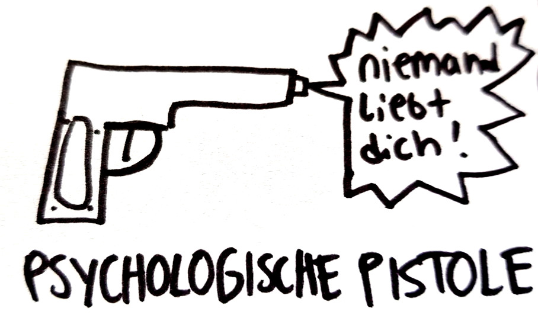

# Psychologische Pistole

Diese App zeigt eine schwarz-weiss Zeichnung von [Tino Bomelino](http://bomelino.de), auf der
eine Pistole abgebildet ist. Es ist eine **Psychologische Pistole** weil sie
nicht *Peng* macht, sondern **niemand liebt dich!**

Das **niemand liebt dich!** wird abgespielt, wenn man das Handy/Smartphone
kräftig schüttelt oder das Bild antippt.

Tino Bomelinos Webseite: [http://bomelino.de](http://bomelino.de)

Quellcode: [https://github.com/no-go/PsychologischePistole/](https://github.com/no-go/PsychologischePistole/)

APK ohne Google Store: [app-release.apk](https://raw.githubusercontent.com/no-go/PsychologischePistole/master/app/app-release.apk)

## Was soll das?

Aktuell ist es nur ein Versuchsbaloon. Mal sehn, was Tino dazu sagt. Kann sein,
dass die App ruck zuck in der Tonne landet!!

## Version v1.3

Mit der Version im Appstore hätte ich einen Preis mit "mehr Abstürze als Installationen"
gewinnen können - hab mich dagegen entschieden.

## Tipp (Versionen unter v1.4)

Bild und Ton wird unter **Documents/click.dummer.psychologischepistole/** abgelegt. Wer will,
kann diese selber anpassen. Den Ordner sieht man oft erst nach einem Neustart des Handys.

## Gewalt

Bekennt Farbe und sagt NEIN zu psychologischer Gewalt jeder Art! Seid fair zueinander.

## License (without images)

This is free and unencumbered software released into the public domain.

Anyone is free to copy, modify, publish, use, compile, sell, or distribute this software, either in source code form or as a compiled binary, for any purpose, commercial or non-commercial, and by any means.

In jurisdictions that recognize copyright laws, the author or authors of this software dedicate any and all copyright interest in the software to the public domain. We make this dedication for the benefit of the public at large and to the detriment of our heirs and successors. We intend this dedication to be an overt act of relinquishment in perpetuity of all present and future rights to this software under copyright law.

THE SOFTWARE IS PROVIDED "AS IS", WITHOUT WARRANTY OF ANY KIND, EXPRESS OR IMPLIED, INCLUDING BUT NOT LIMITED TO THE WARRANTIES OF MERCHANTABILITY, FITNESS FOR A PARTICULAR PURPOSE AND NONINFRINGEMENT. IN NO EVENT SHALL THE AUTHORS BE LIABLE FOR ANY CLAIM, DAMAGES OR OTHER LIABILITY, WHETHER IN AN ACTION OF CONTRACT, TORT OR OTHERWISE, ARISING FROM, OUT OF OR IN CONNECTION WITH THE SOFTWARE OR THE USE OR OTHER DEALINGS IN THE SOFTWARE.

For more information, please refer to [http://unlicense.org](http://unlicense.org)

## Privacy Policy

### Personal information.

Personal information is data that can be used to uniquely identify or contact a single person. I DO NOT collect, transmit, store or use any personal information while you use this app.

### Non-Personal information.

I DO NOT collect non-personal information like user's behavior:

 -  to solve App problems
 -  to show personalized ads

The google play store collect non-personal information such as the data of install (country and equipment).

### Privacy Questions.

If you have any questions or concerns about my Privacy Policy or data processing, please contact me.
